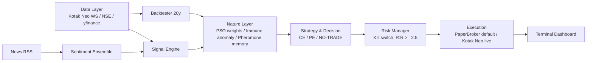

# AutoBot — Nifty 50 Autonomous Options Trading System

An open-source, modular, bio-inspired trading system for the Indian Nifty 50 index (options: CE/PE).
Runs free on open-source software. Defaults to **PAPER TRADING**.

> ## ⚠️ Risk Disclaimer
> No trading system can guarantee profit in all market conditions. SEBI studies show ~9 out of 10
> retail F&O traders lose money. This software is for research/education. Live trading requires an
> explicit double opt-in (config flag + environment variable). You are solely responsible for losses.

## Architecture



## Modules
- `autobot/options_math` — Black-Scholes, full Greeks, IV solver, Max Pain, PCR, GEX
- `autobot/data` — tiered ingestion: broker WebSocket (lowest latency, free with broker), NSE endpoints, yfinance macro
- `autobot/signals` — macro bias, GIFT gap, pivots (PDH/PDL/PDC), OI walls, PCR/VIX regimes
- `autobot/sentiment` — transformer ensemble (FinBERT-tone + DeBERTa-v3) with lexicon fallback, event classifier
- `autobot/nature` — PSO weight evolution, Artificial Immune System anomaly halt, pheromone strategy memory
- `autobot/strategy` — decision engine + risk manager (daily kill switch, asymmetric P&L rule e.g. +50/-20)
- `autobot/execution` — PaperBroker (default) and KotakNeoBroker (guarded live mode)
- `autobot/backtest` — event-driven backtest over up to 20 years of daily data, synthetic option premiums via BS+VIX
- `autobot/terminal` — Rich live dashboard

## Quick start (also works on Google Colab)
```bash
pip install -r requirements.txt
python run_demo.py                      # backtest + PSO training + out-of-sample report
python -m autobot.terminal.dashboard    # live monitoring terminal
```

On Colab:
```python
!git clone https://gitlab.com/vita-group2/autobot.git
%cd autobot
!pip install -r requirements.txt
!python run_demo.py
```

## Kotak Neo live setup (optional, NOT default)
1. `pip install neo-api-client`
2. Set env vars: `KOTAK_CONSUMER_KEY`, `KOTAK_CONSUMER_SECRET`, `KOTAK_MOBILE`, `KOTAK_PASSWORD`, `KOTAK_MPIN`
3. In `config.yaml` set `mode: live` **and** export `AUTOBOT_CONFIRM_LIVE=YES_I_ACCEPT_THE_RISK`

## Mirror to GitHub
```bash
git remote add github https://github.com/TanmayD03/AutoBot.git
git push github main
```

## Data latency tiers
| Tier | Source | Latency | Cost |
|---|---|---|---|
| 1 | Kotak Neo WebSocket (ticks + depth) | ms | free with broker |
| 2 | NSE endpoints (option chain, FII/DII, VIX) | seconds | free |
| 3 | yfinance (global macro) | minutes | free |
| + | TrueData / Global Datafeeds adapter slot | ms | paid (optional) |
